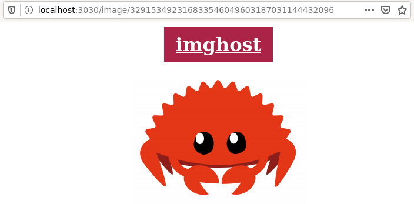

# imghost - self hosted image.. hosting?

A (work in progress) self hosted web thing that stores images.

This is how it looks like:

## Routes

- `GET /` displays the upload form
- `POST /upload` receives a file and redirects to the view page
- `GET /file/<id>` displays an html page that displays the file
- `GET /file/raw/<id>` serves the raw file

## Things that would be nice to have

Alt text.

Javascript progressive enhancement to allow drag and drop. This means using
`fetch` to upload the file instead of submitting the form.

Detect mime type from payload instead of relying on user provided content type.

Reject files that are neither images nor video.

Set the `content-type` in the raw endpoint.

Metadata stripping.

Password protection for uploads. I don't want to end up serving malware. The
password could be stored in a cookie or something so that you don't have to
type it every time.

## Why

It was an excuse to play with web rust. The code is full of `unwrap`s and it's
not meant to be deployed. It may be exploitable. I'm using `warp`, and handling
uploaded files looks a bit weird.
